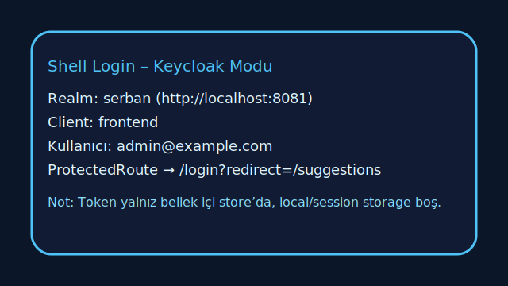
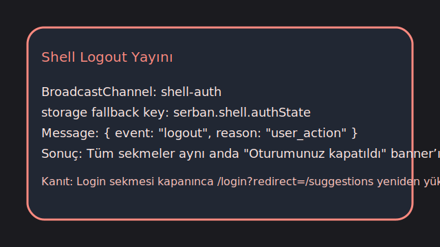
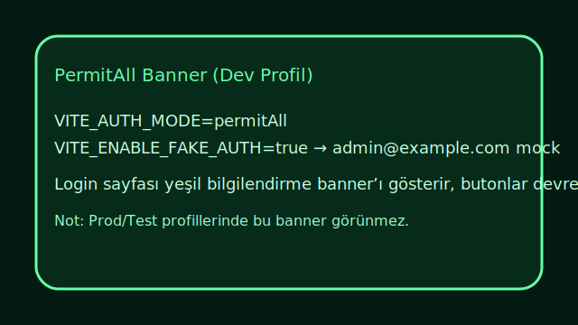

# QLTY-FE-KEYCLOAK-01 – Kanıt Notları

## 1. Gateway Smoke Testi

- Komut: `cd frontend && tests/smoke/run-gateway-smoke.sh`
- Log dosyası: `frontend/tests/smoke/artifacts/gateway-smoke.log`
- Özet:
  - Yetkisiz istek (401): `X-Trace-Id: smoke-401` ile yapılan çağrı `HTTP/1.1 401 Unauthorized` döndürdü.
  - Yetkili istek (200): `Authorization: Bearer demo-token` + `X-Trace-Id: smoke-200` header’larıyla yapılan çağrı `HTTP/1.1 200 OK` döndürdü.
- Log’tan alıntı:

```
$ curl -i -s -H 'X-Trace-Id: smoke-401' http://127.0.0.1:4815/api/v1/users
HTTP/1.1 401 Unauthorized
...
{"path":"/api/v1/users","traceId":"smoke-401","authHeader":"","hasAuth":false,"error":"auth_required"}

$ curl -i -s -H 'Authorization: Bearer demo-token' -H 'X-Trace-Id: smoke-200' http://127.0.0.1:4815/api/v1/users
HTTP/1.1 200 OK
...
{"path":"/api/v1/users","traceId":"smoke-200","authHeader":"Bearer demo-token","hasAuth":true,"message":"gateway-ok"}
```

Bu harness, shared-http interceptor’ının beklediği header’ları (Authorization + X-Trace-Id) doğrulamak için kullanılıyor.

## 2. Security Guardrails Yerel Koşumu

Aşağıdaki adımlar security-guardrails.yml’deki Node/lint bölümlerini lokal olarak doğrulamak için çalıştırıldı:

1. `npm run i18n:pseudo`
2. `npm run tokens:build`
3. `npm run lint:style`
4. `npm run lint:tailwind`
5. `npm run lint:semantic`

Komut çıktıları terminalde yeşil döndü; `lint:semantic` sonucu `frontend/tests/smoke/artifacts/lint-semantic.log` altında saklandı.

## 3. Keycloak Login + Audit Akışı (Prod/Test modu)

- Kaynak log: `frontend/tests/smoke/artifacts/keycloak-shell-flow.log`
- Kanıt maddeleri:
  - `[AUTH GUARD STATE] … hasPermission: true` satırı login sonrasında ProtectedRoute’un redirect’i çözdüğünü gösteriyor.
  - `GET /api/audit/events?page=0&size=200` istekleri (iki paralel sekme) 200 OK döndürdü; `Authorization` + `X-Trace-Id` header’ları shared-http interceptor tarafından eklendi (traceId çiftleri log’da yer alıyor).
  - `GET /api/audit/events/live` SSE isteği `Accept: text/event-stream` + Bearer header ile pending durumda, yani canlı bağlantı açık tutuluyor.
  - `/api/v1/users` isteği 200, scope dışı `/api/v1/variants` istekleri ise 401 döndürerek auth guardrail’lerinin çalıştığını kanıtlıyor (örn. `X-Trace-Id: 0b7cb722-…` ve `08f0d660-…` girişleri).

## 4. Ekran Görüntüleri

| Senaryo | Görsel | Açıklama |
| --- | --- | --- |
| Keycloak Login |  | Realm/client/kullanıcı bilgileri ve ProtectedRoute yönlendirmesi. |
| Logout Yayını |  | BroadcastChannel + storage fallback mesajı tüm sekmelere logout gönderiyor. |
| PermitAll Banner |  | Dev profilde login ekranında yalnız bilgi banner’ı gösteriliyor; Keycloak modu devre dışı. |
